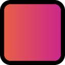
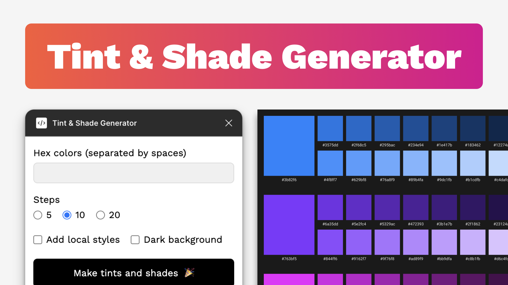

# [](https://www.figma.com/community/plugin/1580658889126377365) &nbsp;[Tint & Shade Generator - Figma plugin](https://www.figma.com/community/plugin/1580658889126377365)



## Overview

Generate a complete set of tints and shades from a base color directly inside Figma. This plugin is the companion to the web version of the [Tint & Shade Generator](https://github.com/edelstone/tints-and-shades), bringing the same, meticulous [color-generation logic](https://github.com/edelstone/tints-and-shades?tab=readme-ov-file#calculation-method) into your design workflow.

## Installation

Grab the plugin directly [from the Figma Community](https://www.figma.com/community/plugin/1580658889126377365).

## Features

- Enter one or multiple hex colors - accepts `#hex`, `hex`, and 3-digit shorthand.
- Generates a palette canvas with base color, tints, and shades.
- Choose number of increments/steps (5, 10, or 20).
- Optional: simultaneously create local Figma color styles with token-friendly naming.
- Optional: choose a dark background.
- Organized layer structure for easy handoff and editing.

## Output structure

- Hex is normalized internally to lowercase.
- Step values use a 100-based scale (100, 200, 300…).

### Layers panel

```text
Tints & Shades
  └─ e96443
        ├─ Base
        │    ├─ Swatch
        │    └─ e96443
        ├─ Tints
        │    ├─ 100
        │    │    ├─ Swatch
        │    │    └─ eb7456
        │    ├─ 200
        │    └─ …
        └─ Shades
             ├─ 100
             │    ├─ Swatch
             │    └─ d25a3c
             ├─ 200
             └─ …
```

### Styles panel

```text
Tints & Shades
  └─ e96443
        ├─ Base
        ├─ Tints
        │    ├─ 100
        │    ├─ 200
        │    └─ …
        └─ Shades
             ├─ 100
             ├─ 200
             └─ …
```

## Local development

1. Download or clone the repo.
2. Run `npm install`.
3. Run `npm run watch` (for development)  
   or `npm run build` (for production).
4. In Figma: _Plugins → Development → Import plugin from manifest…_.
5. Select `manifest.json`.
6. Run via _Plugins → Development → Tint & Shade Generator_.

## Feedback and contributing

If you notice a bug or want to request a feature, please [file an issue on GitHub](https://github.com/edelstone/tints-and-shades-figma/issues/new) or [email me](mailto:contact@maketintsandshades.com) the details.

If you're a developer and want to help, please comment on [open issues](https://github.com/edelstone/tints-and-shades-figma/issues) or create a new one and communicate your intentions. Once we agree on a path forward you can just make a PR and take it to the finish line.

## Support this project

The Tint & Shade Generator plugin will always be free but your support is greatly appreciated.

-   [Buy Me a Coffee](https://www.buymeacoffee.com/edelstone)
-   [Cash App](https://cash.app/$edelstone)
-   [Paypal](https://www.paypal.me/edelstone)
-   [Venmo](https://venmo.com/michaeledelstone)

## License

MIT, use freely in commercial and personal projects.